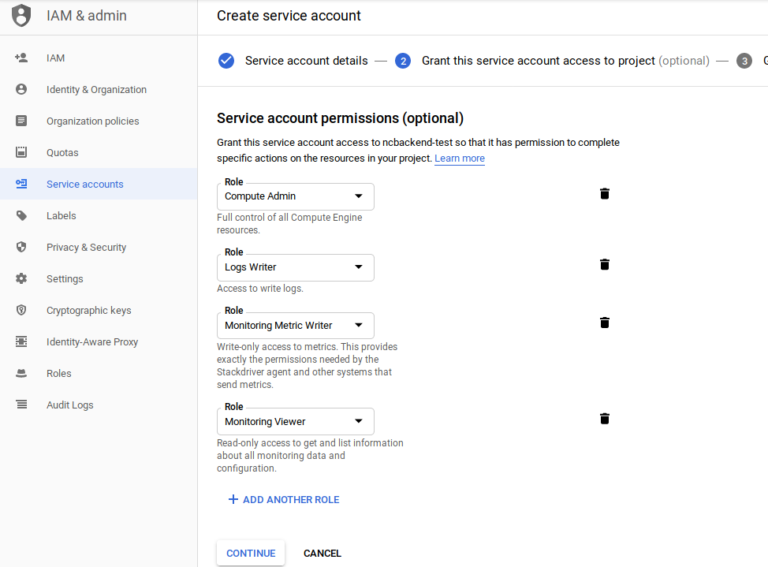

# Example of gke-managed-certs

## Introduction

This guide doesn't try to be generic and there are indeed more ways of generating HTTPS/TLS 
certificates for kubernetes GKE clusters. Instead it provides (hopefully) a reproducible and 
complete guide for generating certificates according to the following:
* Google-managed certificate (not letsencrypt)
* Ingress via google load balancer
* Using "official" https://github.com/GoogleCloudPlatform/gke-managed-certs

Limitations of this approach:
* Ingress only applies to 1 namespace -> 1 load balancer per namespace

Tested on: v1.11.6-gke.3

## Create cluster (optional)

Create a new GKE cluster (if needed) using cloud console

## Create service account for nodes and replace node pool

### Setting up admin API access on nodes and replacing the node pool

A note on security: This will as I understand it allow your nodes in GKE access to compute API,
without understanding this in depth I would recommend using a separate node pool for admin services 
such as this and running your normal workloads on a seperate one with least privilege or default access.

Set up least privilege plus "compute engine admin", reference: https://cloud.google.com/kubernetes-engine/docs/how-to/hardening-your-cluster#use_least_privilege_sa
During role creation:



Then create a new node pool with this service account:

`gcloud container node-pools create node-pool2 --cluster=cert-test-cluster --service-account=<service-account-email>`

Then just delete the old node pool in the GKE UI and wait for things to migrate

### Connect kubectl to cluster and set namespace

```
gcloud container clusters get-credentials <cert-test-cluster>
kubectl create namespace infra
kubectl config set-context $(kubectl config current-context) --namespace=infra # Make infra default namespace
```

## Request ingress IP, set up demo service and DNS
```
gcloud compute addresses create tls-ingress-ip --global
kubectl run web --image=gcr.io/google-samples/hello-app:1.0 --port=8080
kubectl expose deployment web --target-port=8080 --type=NodePort
kubectl get service web
gcloud compute addresses describe tls-ingress-ip --global

```

Using the IP address from the last command, create 1 (or 2 to complete full guide) DNS names (with your DNS provider) 
with A records toward this IP.

e.g. web1.test.com, web2.test.com

Modify deploy/ingress-demo.yaml and specify your domain name and then deploy the ingress:

`kubectl apply -f deploy/base/ingress-demo.yaml`

After a while (5-15min) you should be able to access http://web1.example.com, feel free to continue with the guide 
in the meantime

`kubectl get po -o wide # check status` 

## Deploying gke-managed-cert

NOTE: yamls taken from https://github.com/GoogleCloudPlatform/gke-managed-certs. You may want to use the most up to 
date there instead of from this project but I included here fore reproducibility 

```
kubectl apply -f deploy/example1/managedcertificates-crd.yaml          # Install CRDs
# Give yourself access to deploy cert manager, use real email 
# Give yourself access to deploy cert manager, use real email 
kubectl create clusterrolebinding make-me-cluster-admin --clusterrole=cluster-admin --user=email@example.org
# Give manager cluster admin access 
kubectl create clusterrolebinding managed-certificate-account-cluster-admin --clusterrole=cluster-admin --user=system:serviceaccount:infra:managed-certificate-account      
kubectl apply -f deploy/example1/managed-certificate-controller.yaml   # Install the "cert manager"
```

## Create managed certificate and apply it to ingress

Modify managed-cert.yaml with your domain name, then apply that and annotate the ingress
```
kubectl apply -f deploy/example1/managed-cert.yaml
kubectl annotate ingress test-ingress gke.googleapis.com/managed-certificates=test-cert 
```

You should se (may take some time) your ingress getting new annotations to look similar to:

```
$ kubectl describe ingress test-ingress
Name:             test-ingress
Namespace:        infra
Address:          35.201.65.x
Default backend:  default-http-backend:80 (10.20.5.5:8080)
Rules:
  Host              Path  Backends
  ----              ----  --------
  web1.example.com  
                    /   web:8080 (<none>)
Annotations:
  ingress.kubernetes.io/https-target-proxy:          k8s-tps-infra-test-ingress--ed7c677087a4323e
  ingress.kubernetes.io/ssl-cert:                    mcrt-53a034a7-5dea-4980-83a8-aaf605e4589f
  ingress.kubernetes.io/target-proxy:                k8s-tp-infra-test-ingress--ed7c677087a4323e
  ingress.kubernetes.io/url-map:                     k8s-um-infra-test-ingress--ed7c677087a4323e
  kubectl.kubernetes.io/last-applied-configuration:  {"apiVersion":"extensions/v1beta1","kind":"Ingress","metadata":{"annotations":{"kubernetes.io/ingress.global-static-ip-name":"tls-ingress-ip"},"name":"test-ingress","namespace":"infra"},"spec":{"rules":[{"host":"web1.example.com","http":{"paths":[{"backend":{"serviceName":"web","servicePort":8080},"path":"/"}]}}]}}

  gke.googleapis.com/managed-certificates:      test-cert
  ingress.gcp.kubernetes.io/pre-shared-cert:    mcrt-53a034a7-5dea-4980-83a8-aaf605e4589f
  ingress.kubernetes.io/backends:               {"k8s-be-30117--ed7c677087a4323e":"HEALTHY","k8s-be-31334--ed7c677087a4323e":"HEALTHY"}
  kubernetes.io/ingress.global-static-ip-name:  tls-ingress-ip
  ingress.kubernetes.io/forwarding-rule:        k8s-fw-infra-test-ingress--ed7c677087a4323e
  ingress.kubernetes.io/https-forwarding-rule:  k8s-fws-infra-test-ingress--ed7c677087a4323e
Events:
  Type    Reason  Age    From                     Message
  ----    ------  ----   ----                     -------
  Normal  ADD     6m38s  loadbalancer-controller  infra/test-ingress
  Normal  CREATE  5m26s  loadbalancer-controller  ip: 35.201.65.90


```

Provisioning the certificate may take some time and you can follow the progress in cloud console UI ->  Network Services -> Load balancer -> your new lb -> mcrt-... (may say "provisioning for some time)

You can also check:
```
gcloud compute ssl-certificates list
gcloud compute ssl-certificates describe mcrt-<your cert>
kubectl get/describe mcrt test-cert
```

Even after everything looks good it might still take some time before the load balancer properly terminates https 
(you may see handshake errors)

Eventually it should work via https too!

## Next level - more services, more certs and different namespaces

### Example 2 - Multiple domains sharing load balancer and ingress in single namespace

NOTE: requires example 1 

```bash
kubectl run web2 --image=gcr.io/google-samples/hello-app:2.0 --port=8080
kubectl expose deployment web2 --target-port=8080 --type=NodePort
# Modify domain name in deploy/example2/managed-cert-web2.yaml
kubectl apply -f deploy/example2/managed-cert-web2.yaml
kubectl apply -f deploy/example2/ingress-demo-v2.yaml
kubectl annotate ingress test-ingress gke.googleapis.com/managed-certificates=test-cert,web2-cert

```

### Example 3 - Deploying certs in other namespaces

Each load balancer can only be linked to one ingress and each ingress can only reference services in it's own namespace
The certificate controller as installed above manages certs in all namespaces. To use it in a new namespace, the 
following is needed:

```bash
kubectl create ns apps
kubectl config set-context $(kubectl config current-context) --namespace=apps
gcloud compute addresses create apps-ingress-ip --global                 # Request IP
gcloud compute addresses describe apps-ingress-ip --global               # Get IP
# Set up DNS record to web3.example.com to the IP
kubectl apply -f deploy/example3/managed-cert-3.yaml                     # Define cert to reference in ingress
kubectl run web2 --image=gcr.io/google-samples/hello-app:2.0 --port=8080 # Create a new "web2" in apps namespace
kubectl expose deployment web2 --target-port=8080 --type=NodePort
kubectl apply -f deploy/example3/ingress-demo-v3.yaml                    # incl. cert annotation, triggers complete setup
``` 

## Troubleshooting

The controller pod doesn't log to stdout for some reason so you can't check it's logs in stackdriver so you need to 
look at the log file which is not so convenient in a container that doesn't even have bash nor basic tools like less.

```bash
kubectl exec -it --namespace infra managed-certificate-controller-54fbb9cf78-74jxl -- /bin/sh
# tail -n 30 /var/log/managed_certificate_controller.log

```